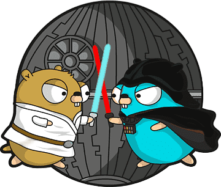

<div align="center">

# 🛡️ go2ban

[](https://www.gnu.org/licenses/gpl-3.0)

[](https://pkg.go.dev/github.com/vv198x/go2ban)
[](https://goreportcard.com/report/github.com/vv198x/go2ban)
[](https://golang.org)

**Powerful VDS/VPS protection system against brute force attacks, scanners and DDoS**



</div>

---

## 🌍 Why is go2ban important today?

> **📊 Shocking statistics:** More than 50% of all internet traffic consists of hacker bots, password crackers, and automated vulnerability scanners. Every day, thousands of servers are attacked, leading to enormous losses of computational resources and administrators' time.

**go2ban** is a modern solution for protecting your servers that not only blocks attackers but also significantly saves computational power, making the internet safer for everyone.

### 🎯 Key advantages

- **⚡ Instant blocking** in iptables raw table
- **🔍 Smart monitoring** of service logs and Docker containers  
- **🎣 Trap ports** for automatic scanner detection
- **🌐 REST API and gRPC** for integration with your systems
- **📈 Resource savings** — up to 70% reduction in CPU load
- **🛡️ Whitelist** for trusted IP addresses

> **📚 New!** [Performance Optimization Guide](OPTIMIZATION.md) — Learn how to fine-tune go2ban for maximum efficiency!

---

## 🚀 Quick Installation (Recommended)

For the easiest installation experience, use the automated installation script:

```bash
# Clone the repository
git clone https://github.com/vv198x/go2ban.git
cd go2ban

# Run the installation
chmod +x install.sh
./install.sh
```

### ✨ What the script does automatically:

- ✅ Checks and installs Go 1.21.6 if needed
- ✅ Installs dependencies (make, git, wget)
- ✅ Builds the go2ban binary
- ✅ Installs the systemd service
- ✅ Opens the configuration file for editing
- ✅ Optionally starts and enables the service

> **💡 Tip:** Run the script as a regular user (not root). It will prompt for sudo password when needed.

---

## 🔧 Manual Installation

### Prerequisites
Make sure you have Go version >=1.15 installed

```bash
# 1. Clone the repository
git clone https://github.com/vv198x/go2ban.git

# 2. Build the binary
make

# 3. Run the installer
sudo make install

# 4. Configure go2ban
vi /etc/go2ban/go2ban.conf

# 5. Start and enable the service
sudo systemctl --now enable go2ban
```

---

## ⚙️ Configuration

The [config](deploy/go2ban.conf) file allows you to customize all aspects of operation:

### 🔥 Basic settings

| Parameter | Description | Default |
|-----------|-------------|---------|
| `firewall` | Automatic firewall rule management or disable | `auto` |
| `log_dir` | Directory for go2ban logs | `/var/log/go2ban` |
| `white_list` | IP addresses that will never be blocked | - |
| `blocked_ips` | Maximum number of blocked IPs | `1000` |

### 🌐 API and integrations

| Parameter | Description | Default |
|-----------|-------------|---------|
| `grpc_port` | Port for gRPC communication | `off` |
| `rest_port` | Port for REST API blocking | `off` |

### 🎣 Traps and protection

| Parameter | Description | Default |
|-----------|-------------|---------|
| `trap_ports` | Trap ports for scanners | `off` |
| `trap_fails` | Number of attempts before blocking | `3` |
| `local_service_check_minutes` | Frequency of service checking | `5` |
| `local_service_fails` | Number of failed attempts | `5` |

### 🌍 AbuseIPDB integration

| Parameter | Description | Default |
|-----------|-------------|---------|
| `abuseipdb_apikey` | API key for AbuseIPDB | `off` |
| `abuseipdb_ips` | Number of IPs to block from AbuseIPDB | `100` |

> **💡 Looking for optimization tips?** Check out our [Performance Optimization Guide](OPTIMIZATION.md) for best practices, benchmarks, and advanced tuning recommendations!

---

## 💻 Command line

```bash
go2ban [options]

Options:
  -cfgFile string
        Path to configuration file
  -clear
        Unblock all IPs
  -d    Run as daemon
```

---

## 🎯 How it works

go2ban runs as a background service, constantly monitoring:

1. **📊 Service logs** — databases, web servers, Docker containers
2. **🔍 Connection attempts** to trap ports
3. **🌐 External threats** via AbuseIPDB API
4. **⚡ Automatic blocking** in iptables raw table

### 🚀 Advantages of blocking in raw table

| Advantage | Description |
|-----------|-------------|
| **⚡ Speed** | Raw table is the first table in the iptables chain, providing instant blocking |
| **🛡️ Security** | Strong first line of defense against incoming traffic |
| **💾 Resource savings** | Connections are never established, reducing CPU load |

---

## 🌟 Impact on the ecosystem

### 📈 Computational power savings

Thanks to effective blocking of attackers at the raw table level, go2ban helps:

- **Reduce CPU load** by up to 70% on attacked servers
- **Save network bandwidth**
- **Reduce response time** for legitimate users
- **Make the internet faster** for everyone

### 🌍 Security for everyone

Every blocked attacker means:
- ✅ Fewer attacks on other servers
- ✅ Reduced overall threat level in the network
- ✅ More stable operation of internet infrastructure

---

## 🛠️ Development

go2ban is developed in **Go** using **iptables** for firewall management. The code is open to the community, and we welcome developer contributions!

### 🏗️ Technology stack

- **Go 1.21.6+** — main development language
- **iptables/netfilter** — firewall management
- **systemd** — system service
- **gRPC/REST** — API for integration

---

## 📋 Changelog

For a detailed list of changes in each version, see the [change.log](change.log) file in the repository.

---

## 🤝 Support

If you encounter any issues or have questions:

- 📝 [Create an Issue](https://github.com/vv198x/go2ban/issues)
- 💬 Contact the developer
- 📚 Study the documentation

---

<div align="center">

**🛡️ Protect your server today and help make the internet safer!**

[⭐ Star on GitHub](https://github.com/vv198x/go2ban)

</div>